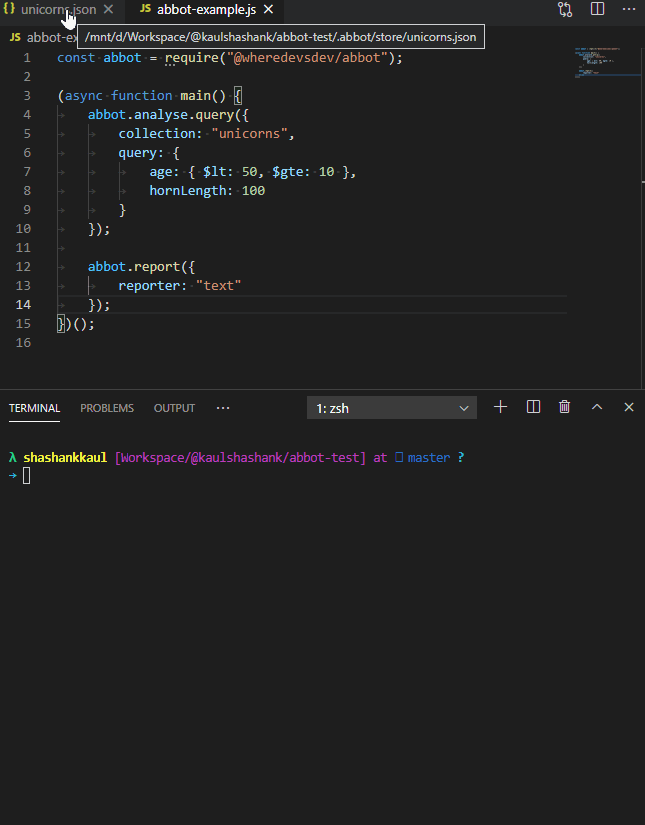

# Abbot

	MongoDB query and index analysis with suggestions to make your queries faster. 
	 
	 
	

---

Check out our documentation over <a href="https://abbot.wheredevs.dev">here</a>.

---

## Roadmap

### v1.0.0

- [ ] HTML Reporter
- [ ] 100% unit test coverage for algorithms

### Long term

- [ ] Weights for algorithms to provide impact for suggestions.
- [ ] Custom reporter API
- [ ] Cover pending MongoDB operators/API